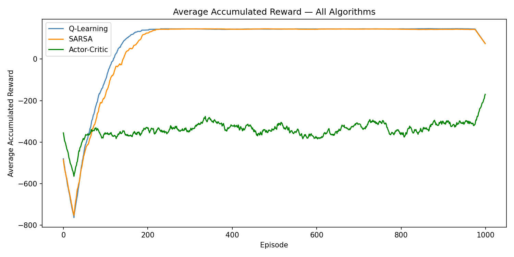
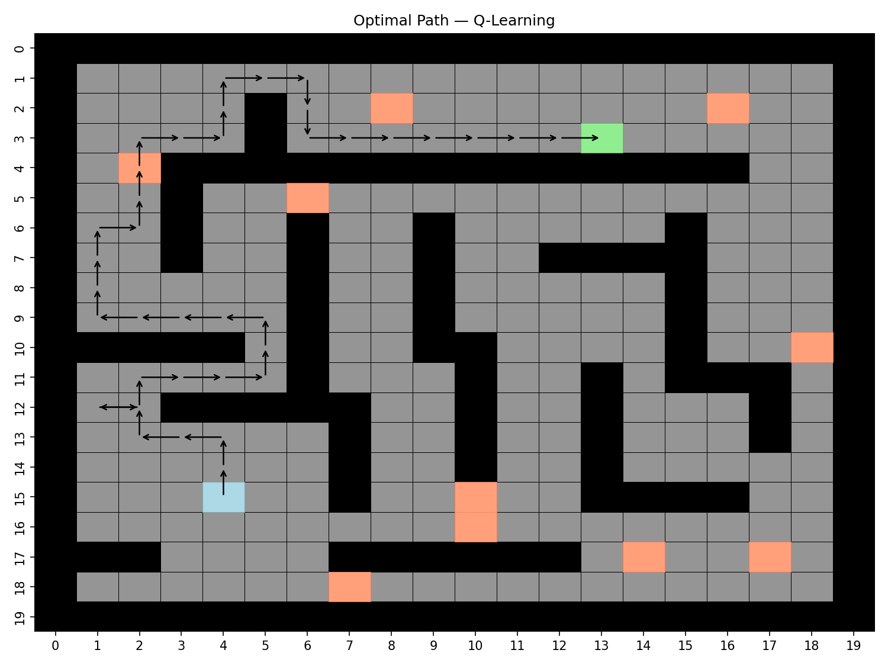
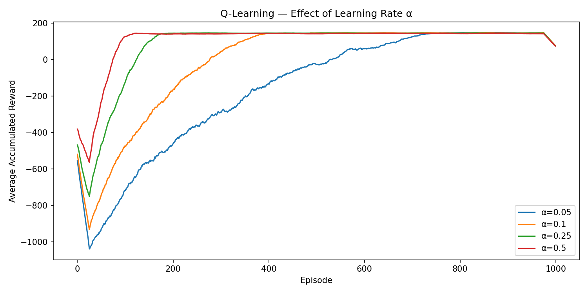
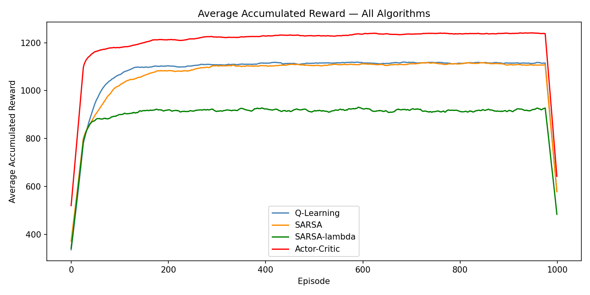
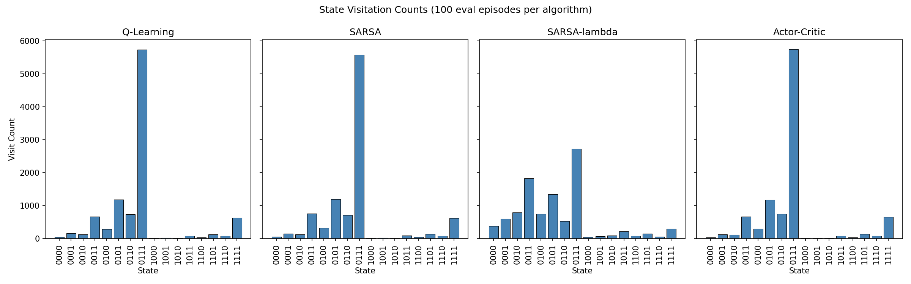
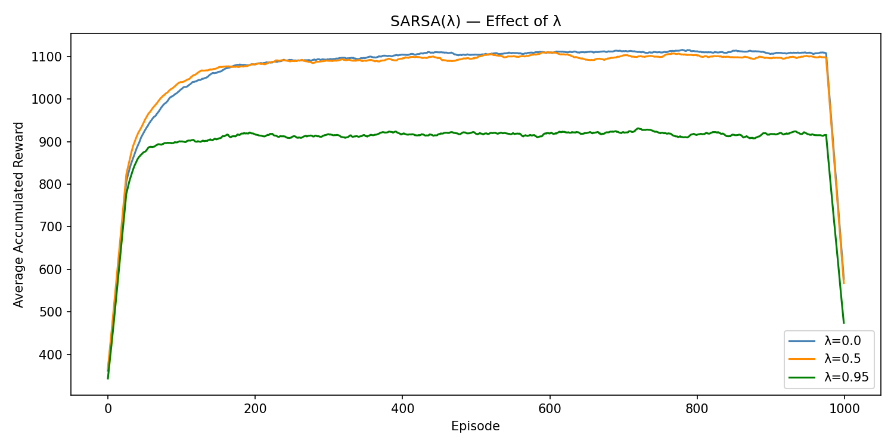

# EECE 5614 — Project 3: Temporal Difference Learning

**Shoukang Yu · Northeastern University · Spring 2026**

This project implements and compares temporal-difference (TD) learning algorithms on two environments carried over from Project 2: a stochastic maze and a Boolean gene regulatory network. Unlike the model-based dynamic programming methods used in Project 2, all algorithms here learn purely from sampled experience — no transition model is needed.

---

## Problem 1 — Stochastic Maze (20 × 20)

### What was done

Three TD algorithms are trained on the same 20 × 20 stochastic maze from Project 2. At each step the agent can drift to an adjacent cell with probability p = 0.025 instead of moving in the intended direction. A reward of +200 is given upon reaching the goal; every other step incurs −1.

| Algorithm | Type | Update target |
|-----------|------|---------------|
| Q-Learning | Off-policy | `r + γ max_a' Q(s',a')` |
| SARSA | On-policy | `r + γ Q(s', a')` where a' is the next ε-greedy action |
| Tabular Actor-Critic | Policy-gradient | Critic updates V(s) via TD error δ; actor updates H(s,a) via δ(1−π(a\|s)) |

Each algorithm is run for 10 independent seeds. After training, the greedy policy is evaluated from the start state to measure path success.

### Key parameters

| Parameter | Value |
|-----------|-------|
| Stochastic drift p | 0.025 |
| Discount γ | 0.96 |
| Learning rate α | 0.25 |
| Exploration ε | 0.1 (Q-Learning, SARSA) |
| Actor learning rate β | 0.2 (tuned) |
| Episodes | 1,000 (Q-Learning, SARSA); 2,000 (Actor-Critic) |
| Max steps / episode | 1,000 |

### Results

#### Path success rate (out of 10 runs)

| Algorithm | Paths found |
|-----------|-------------|
| Q-Learning | **10 / 10** |
| SARSA | **10 / 10** |
| Actor-Critic | 2 / 10 |

Q-Learning and SARSA both achieve perfect success. Actor-Critic struggles because the actor update depends on the accuracy of the TD error δ — when V(s) is poorly initialized, the policy gradient pushes action preferences in the wrong direction, creating a chicken-and-egg dependency that makes convergence rare in sparse-reward environments.

#### Algorithm comparison — average accumulated reward



Q-Learning (blue) converges the fastest (~episode 100), followed closely by SARSA (orange). Actor-Critic (green) remains highly noisy throughout all 1,000 episodes, never rising above −200, confirming the difficulty of policy-gradient methods in sparse-reward, large state-space settings.

#### Learned policy and optimal path (Q-Learning)

| Policy | Path |
|--------|------|
|  |  |

#### Effect of learning rate α on Q-Learning



Larger α converges faster but causes more variance in early episodes. α = 0.25 gives the best balance between speed and stability.

---

## Problem 2 — p53-Mdm2 Gene Network

### What was done

The 4-gene Boolean network from Project 2 is treated as a 16-state MDP. The state s ∈ {0,1}⁴ evolves under stochastic XOR dynamics with Bernoulli noise (p = 0.1). The reward is `R(s,a,s') = 5‖s'‖₁ − c(a)` — the agent is rewarded for keeping genes ON and penalised for costly interventions. The goal state is [1,1,1,1].

A fourth algorithm, **SARSA(λ)**, is added in this problem to study the effect of eligibility traces:

```
δ       = r + γ Q(s',a') − Q(s,a)
e(s,a) += 1
Q       += α · δ · e          (for all s, a)
e       *= γ · λ              (for all s, a)
```

| Parameter | Value |
|-----------|-------|
| Noise p | 0.1 |
| Discount γ | 0.9 |
| Learning rate α | 0.25 |
| Exploration ε | 0.15 |
| Actor learning rate β | 0.05 |
| Eligibility trace λ | 0.95 |
| Episodes | 1,000 |
| Max steps / episode | 100 |

### Results

#### Algorithm comparison — average accumulated reward



Actor-Critic (red) achieves the highest plateau (~1,230) because the softmax policy provides denser gradient signals across all states. Q-Learning and SARSA both converge near 1,100. SARSA(λ) with λ = 0.95 settles at only ~910 — the long eligibility traces over-propagate credit in this dense-reward, short-episode environment, introducing noise rather than accelerating learning.

#### State visitation counts (100 greedy evaluation episodes)



Q-Learning, SARSA, and Actor-Critic all concentrate visits on state [0,1,1,1] (~5,700 out of 10,000 steps) — the best stable attractor under stochastic gene flipping. SARSA(λ) shows a more dispersed pattern, confirming its lower policy quality.

#### Effect of λ on SARSA(λ)



λ = 0 (one-step SARSA) achieves the highest reward (~1,080). Performance degrades monotonically as λ increases, peaking at λ = 0.95 (~910). This shows that larger λ is harmful in dense-reward environments — its benefit is most pronounced when rewards are sparse and delayed.

---

## How to Run

```bash
# Problem 1 — maze
cd problem1
python run_experiments.py

# Problem 2 — gene network
cd problem2
python run_experiments.py
```

All figures are saved automatically to the `result/` folder inside each problem directory.

---

## Repository Structure

```
project3/
├── problem1/
│   ├── maze_env.py          # 20×20 stochastic maze (reused from Project 2)
│   ├── q_learning.py        # Q-Learning
│   ├── sarsa.py             # SARSA
│   ├── actor_critic.py      # Tabular Actor-Critic
│   ├── visualize.py         # Plotting utilities
│   ├── run_experiments.py   # Main entry point
│   └── result/              # Output figures
└── problem2/
    ├── gene_env.py          # p53-Mdm2 gene network environment
    ├── q_learning.py        # Q-Learning
    ├── sarsa.py             # SARSA
    ├── sarsa_lambda.py      # SARSA(λ) with eligibility traces
    ├── actor_critic.py      # Tabular Actor-Critic
    ├── run_experiments.py   # Main entry point
    └── result/              # Output figures
```
